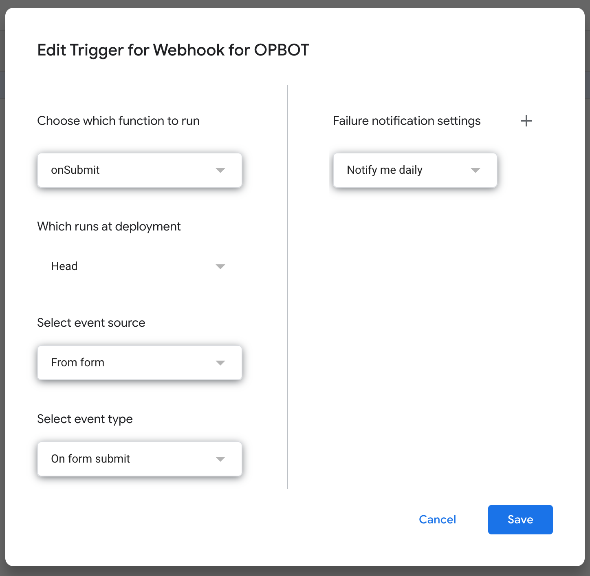

# OPBOT - Another Python cogs-based discord bot

## Overview

The following is a python based bot designed to help the UNSW OPSOC discord sever generate engagement and allow for members to get additional information about the OP universe.

### Considerations

When designing the bot the following was considered.

- Able to be run through an always-online server running docker
- Low maintenance
- Low processing power and networking bandwidth

## Features

- [x] Help page with up-to-date spec
- [x] Random image generator (inc data)
- [x] Bot stats
- [ ] RPG-style character collector
- [ ] Search character feature
- [x] Guess the character game
- [x] User profile
- [x] Auto reverification tagger
- [x] Manual verification bypass
- [x] Verification logs + timestamps

## The Setup

1. If api keys or config file does not exist create a new file named ```config.ini``` and insert the following

    ``` ini
    [keys]
    DiscordAPI-Key=XXXX.XXXX.XXXX

    [verification]
    webhookCommand=Command!
    webhookBotID=1234567890
    targetChannelID=1234567890
    unverifiedRole=role1
    verifiedRole=role2
    errorStateChannel=1234567890

    [adminstration]
    level1OverRide=1234567890
    level2OverRideRole=role3

    [testing]
    isproduction=false
    disableAdmin=false
    DisableMultiplayer=false
    ```

2. Start instance of Docker

3. Build script using docker

    ``` linix
    docker build -t dockerfile .
    ```

4. Run script from docker command

    ``` linix
    docker run -dp dockerfile
    ```

## Data loging and information

There is a comprehensive verification log with time stamps in the "admin.log" file, "rpgData.log" is a secondary log for user info.

## Google app script plugin module

To implement verification with google forms a webhook is used to read received messages. You can implement the code linked to a Google form here.

- <https://script.google.com/>
- The corresponding setting used should be:



```gs
const POST_URL = {Webhook URL};

function onSubmit(e) {
  Utilities.sleep(30000);

  const response = e.response.getItemResponses();
  let items = [];
  let username = "";

  for (const responseAnswer of response) {
    const question = responseAnswer.getItem().getTitle();
    const answer = responseAnswer.getResponse();
    let parts = []

    try {
      parts = answer.match(/[\s\S]{1,1024}/g) || [];
    } catch (e) {
      parts = answer;
    }

    for (const [index, part] of Object.entries(parts)) {

      if (question == "Discord Tag (e.g. abcde#1234)") {
        username = part;
      }
    }
  }

  const options = {
    "method": "post",
    "headers": {
      "Content-Type": "application/json",
    },
    "payload": JSON.stringify({
      "content": "Auth!verifyUserWebServer1.1 " + username
    })
  };

  UrlFetchApp.fetch(POST_URL, options);
};

```

## Maintaining functionality
Generate Python module requirements with

    ``` linix
    pipreqs ./ --force
    ```
